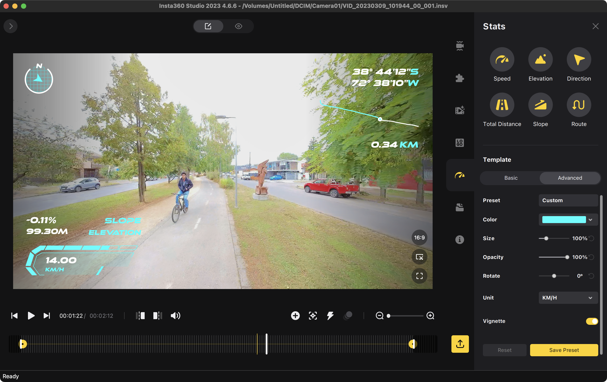
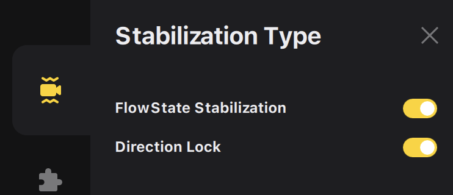
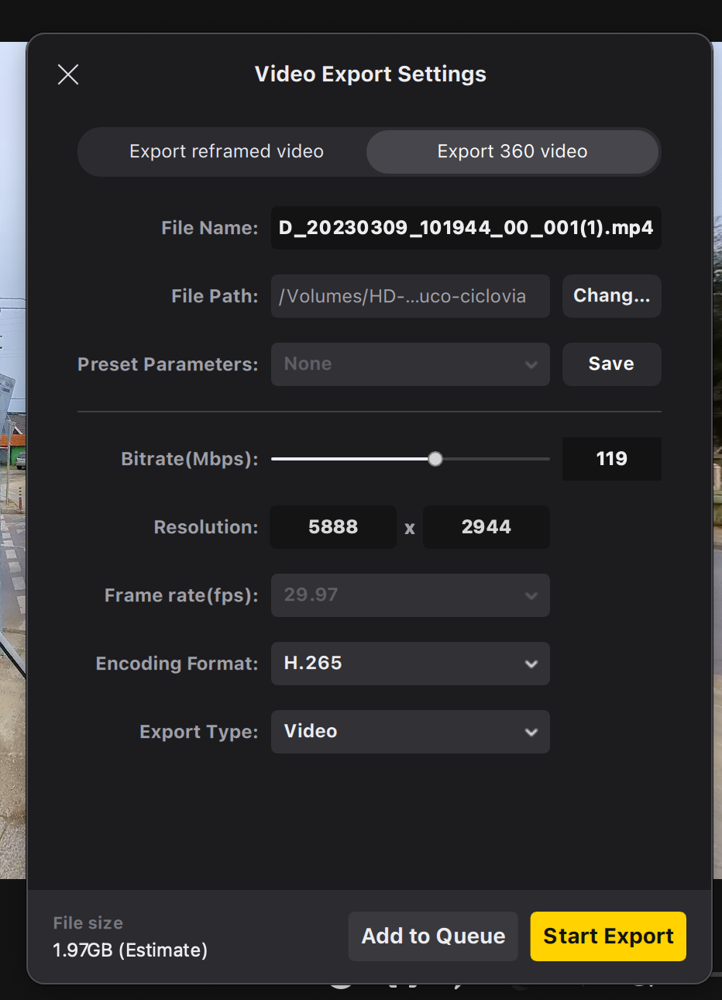
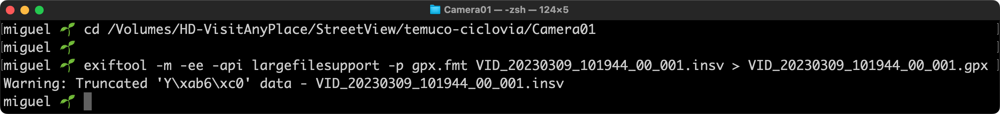

# exiftool-insta360-gpx

Generate .gpx file having Insta360 video (.insv)

Capturing 360 video with the [Insta360 ONE RS 1' 360 edition](https://www.insta360.com/product/insta360-oners/1inch-360) and then upload to Google Street View (in Google Street View Studio). Steps:

1) Capture the 360 video (in this case using the [Insta360 GPS Action Remote](https://store.insta360.com/product/gps-action-remote?c=2156))
2) Transfer files to an external storage drive
3) Export 360 video file as .mp4 (no trim) in the Insta360 Studio (Direction Lock must be enabled)
4) Create the .gpx file with [exiftool](https://exiftool.org) like this `exiftool -m -ee -api largefilesupport -p gpx.fmt VID_20230309_101944_00_001.insv > VID_20230309_101944_00_001.gpx`
5) Go to [Google Street View Studio](https://streetviewstudio.maps.google.com/) and upload the .mp4 & .gpx files.
6) Wait...

## gpx.fmt file

[/gpx.fmt](/gpx.fmt) file (modify as you needed)

```diff
#[HEAD]<gpx xmlns="http://www.topografix.com/GPX/1/1" xmlns:gpxx="http://www.garmin.com/xmlschemas/GpxExtensions/v3" xmlns:gpxtpx="http://www.garmin.com/xmlschemas/TrackPointExtension/v1" creator="Oregon 400t" version="1.1" xmlns:xsi="http://www.w3.org/2001/XMLSchema-instance" xsi:schemaLocation="http://www.topografix.com/GPX/1/1 http://www.topografix.com/GPX/1/1/gpx.xsd http://www.garmin.com/xmlschemas/GpxExtensions/v3 http://www.garmin.com/xmlschemas/GpxExtensionsv3.xsd http://www.garmin.com/xmlschemas/TrackPointExtension/v1 http://www.garmin.com/xmlschemas/TrackPointExtensionv1.xsd">
#[HEAD]<trk>
#[HEAD]<trkseg>
#[IF]  $gpslatitude $gpslongitude
#[BODY]<trkpt lat="$gpslatitude#" lon="$gpslongitude#">
#[BODY]  <ele>$gpsaltitude#</ele>
-#[BODY]  <time>${gpsdatetime#;my ($ss)=/\.\d+/g;DateFmt("%Y-%m-%dT%H:%M:%SZ");s/Z/${ss}Z/ if $ss}</time>
+#[BODY]  <time>${gpsdatetime#;my ($ss)=/\.\d+/g;DateFmt("%Y-%m-%dT%H:%M:%S+04");s/Z/${ss}Z/ if $ss}</time>
#[BODY]</trkpt>
#[TAIL]</trkseg>
#[TAIL]</trk>
#[TAIL]</gpx>
```


## Pictures

Check GPS data in the 360 video:


Enable `Direction Lock`:


Export as .mp4:


Create .gpx file (warning shows up):

